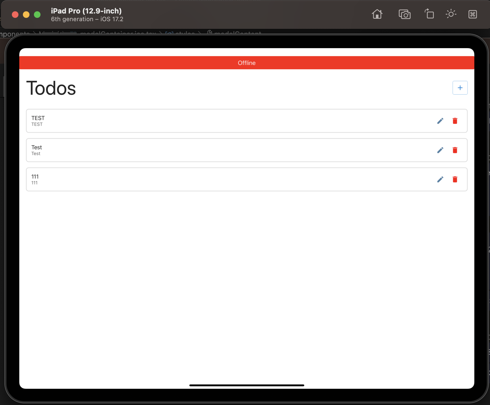
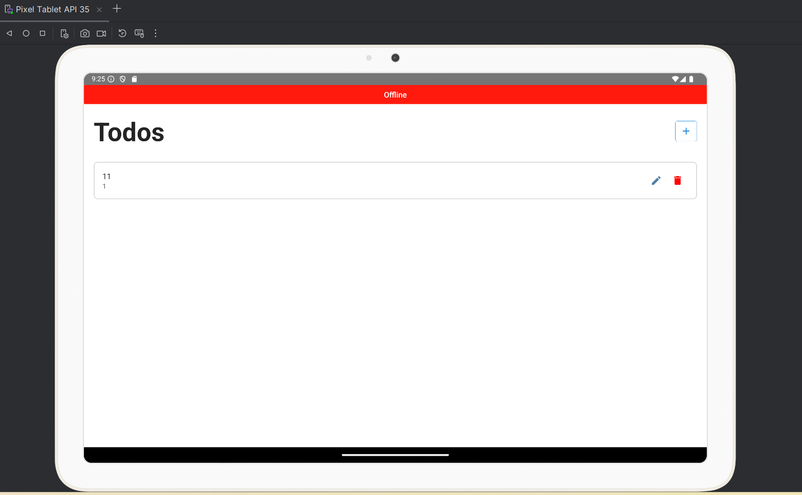
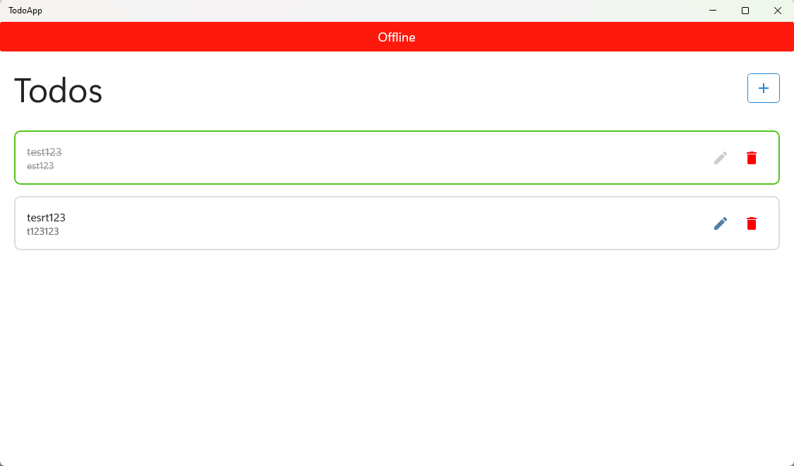

# Full Offline Yaklaşımlı React Native Uygulama(IOS,ANDROID,WINDOWS SUPPORT)

Bu proje, mobil cihazlar üzerinde full offline mimariyi temel alan, React Native kullanılarak geliştirilmiş bir uygulama örneğidir.

## Özellikler

- **Full Offline Mimari**: Kullanıcıların, internet bağlantısı olmadığında bile uygulamayı sorunsuz bir şekilde kullanabilmesini sağlar.
- **Online-Offline Senkronizasyon**: Offline moddayken kaydedilen veriler, cihaz online olduğunda backend'e senkronize edilir.
- **Veri Kaybına Karşı Dayanıklılık**: Tüm veriler, SQLite kullanılarak yerel olarak saklanır ve TypeORM yardımıyla yönetilir.
- **Hata Yönetimi ve Bildirimler**: Kullanıcıya senkronizasyon süreci hakkında geri bildirim verir ve hataları ele alır.
- **Esnek Mimari**: React Query ile soyutlanmış yapılar, çevrimdışı ve çevrimiçi işlemler arasında kolay geçiş sağlar.

## Kullanım Alanları

- **Saha Çalışmaları**: Zayıf internet bağlantısına sahip bölgelerde verimli çalışma.
- **Uzun Süreli Kesintiler**: Kullanıcıların internet kesintisi sırasında engellenmeden çalışabilmesi.
- **Çoklu Cihaz Senaryoları**: Farklı cihazlarda aynı verilere erişim ve senkronizasyon.

## Mimari

### İşleyiş
1. **Çevrimdışı Veri Kayıt**:
   - Kullanıcıların yaptığı işlemler SQLite üzerine kaydedilir.
   - TypeORM yardımıyla yerel veritabanı işlemleri gerçekleştirilir.
2. **İş Mantığı**:
   - Offline modda yapılan işlemler backend çalışmadan mobil cihazda da uygulanabilir.
3. **Senkronizasyon**:
   - Cihaz internet bağlantısı tespit ettiğinde, **lastSyncTime** değeri üzerinden eklenen, güncellenen veya silinen veriler backend'e iletilir.
   - Backend ile veri transferi optimize edilir.

### Kullanılan Teknolojiler

#### Frontend
- **React Native**: Mobil uygulama geliştirme.
- **React Query**: Veri yönetimi ve senkronizasyon.
- **SQLite**: Yerel veri saklama.
- **TypeORM**: Veritabanı işlemleri.

#### Backend
- **Socket**: Gerçek zamanlı durum bildirimleri.
- **DTO (Data Transfer Objects)**: Verilerin tutarlılığı ve transfer kolaylığı için.

## Kod Örnekleri

### İş Mantığı ve Senkronizasyon
#### useBaseMutation
```typescript
const useBaseMutation = <T, K extends BaseResponseDTO | undefined>({
  service,
  offlineService,
  onSuccess,
  onError,
}: UseBaseMutationParams<T, K | undefined>) => {
  const {isConnected} = useInitializer();
  const toast = useToast();

  const {mutate, data, isError, isSuccess, isPending, error} = useMutation<
    K | undefined,
    IBaseMutationError,
    T
  >({
    onSuccess(_data) {
      handleSuccess(_data ?? undefined);
    },
    onError(_error, _data) {
      handleError(_error, _data);
    },
    mutationFn: e => {
      if (isConnected) {
        return service(e);
      } else {
        return offlineService!(e);
      }
    },
  });

  const handleSuccess: SuccessCallback<K> = async _data => {
    if (onSuccess?.callback) {
      onSuccess?.callback(_data);
    }
  };

  const handleError = async (_error: any, _data: T) => {
    if (onError?.callback) {
      onError.callback(_error);
    }
  };

  return {mutate, data, isError, isSuccess, isPending, error};
};

export default useBaseMutation;
```

#### useBaseQuery
```typescript
const useBaseQuery = <
  ReqT extends BaseRequestParams | undefined,
  ResK,
  MappingT = ResK,
>({
  service,
  offlineService,
  queryKeys,
  select,
  onSuccess,
  onError,
  enabled,
  initialData = undefined,
}: UseBaseQueryParams<ReqT, ResK, MappingT>) => {
  const {isConnected} = useInitializer();
  const queryFn = useCallback(
    async (e: any) => {
      if (isConnected) {
        return service(e.queryKey[1]);
      } else {
        if (offlineService) {
          return offlineService(e.queryKey[1]);
        }
        throw new Error('Offline service is not defined.' + queryKeys);
      }
    },
    // eslint-disable-next-line react-hooks/exhaustive-deps
    [isConnected, queryKeys],
  );

  const {data, isError, isSuccess, isLoading, isFetching, error, refetch} =
    useQuery({
      queryKey: queryKeys,
      queryFn: queryFn,
      select: _data => {
        return select ? (select(_data as ResK) as any) : (_data as ResK);
      },
      retry: false,
      refetchOnMount: false,
      refetchOnReconnect: false,
      refetchOnWindowFocus: false,
      enabled: enabled,
      initialData: initialData,
    });

  if (isError) {
    if (onError?.callback) {
      onError.callback(error);
    }
  }

  if (isSuccess) {
    if (onSuccess?.callback) {
      onSuccess.callback(data);
    }
  }

  return {data, isError, isSuccess, isLoading, error, isFetching, refetch};
};

export default useBaseQuery;
```

## Nasıl Kurulur?

1. **Depoyu Klonla:**
   ```bash
   git clone <repo-url>
   ```
2. **Bağımlılıkları Kur:**
   ```bash
   npm install
   ```

4. **Uygulamayı Çalıştır:**
   ```bash
   npm run android
   npm run ios
   npm run windows
   ```

 ## ScreenShots

 
 
 


## Lisans
Bu proje [MIT Lisansı](LICENSE) altında lisanslanmıştır.

